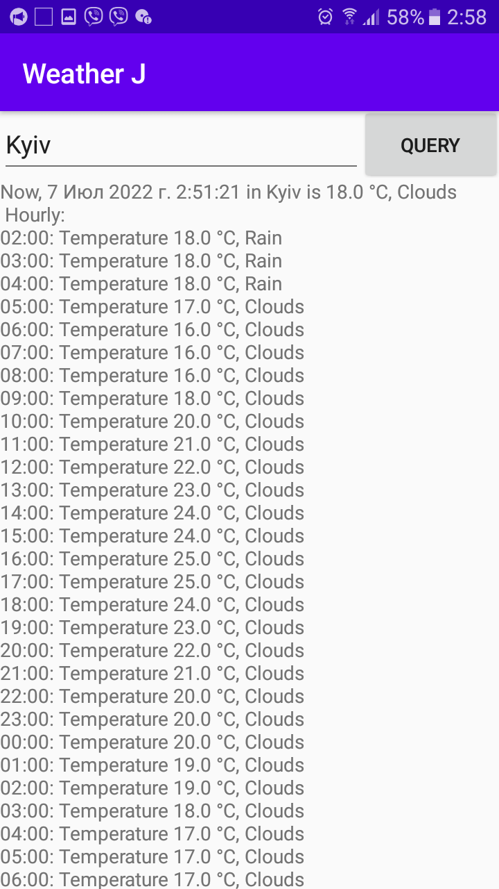

# Weather

Тестовая программа “Прогноз погоды”
Программа изначально была написана на Java с использованием OkHttpClient и GSON (см. первый коммит). Погода запрашивается на openweathermap.org. Так как программа учебная, бесплатный ключ к Weather API лежит прямо в коде.

Далее Java-код был конвертирован в Kotlin, а уже там где вместо OkHttpClient был использован Ktor и внесено множество других изменений.
Код можно посмотреть здесь: https://github.com/GeorgeBobrov/WeatherK. В этой же версии вывод прогноза просто текстовый.

После добавления в Kotlin-версии задгрузки иконок погоды с помощью AsyncTask и java.net.URL, было решено и здесь отказаться от внешней библиотеки OkHttp (которая сама по себе написана на Kotlin) и полностью перевести загрузку на AsyncTask и java.net.URL.
Изменения можно посмотреть в истории коммитов.

Web-версию программы можно посмотреть здесь:
https://skivvvvy.gitlab.io/weather/